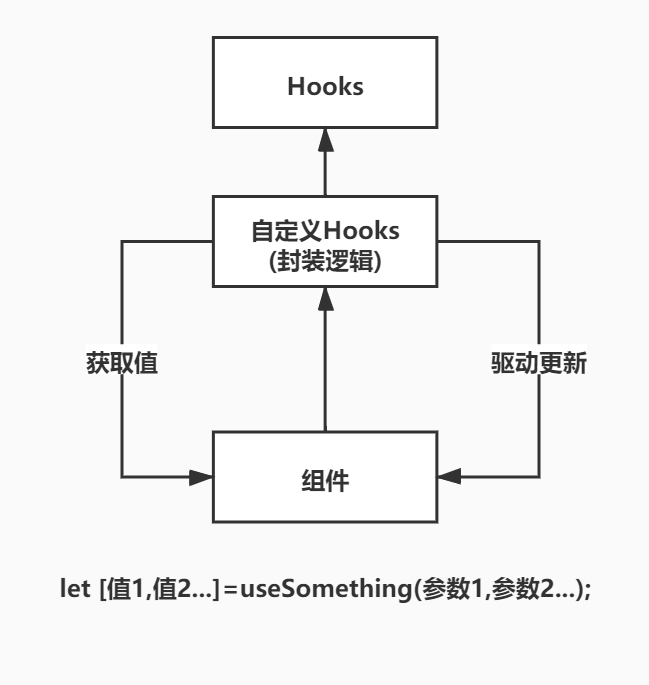

### React Hooks

- Hook 是 React 16.8 的新增特性。它可以让你在不编写 class 的情况下使用 state 以及其他的 React 特性

#### 1.1 Hooks 优点

- 可以抽离公共方法和逻辑，提高代码的可复用性
- 函数式组件更简介，开发效率更高

#### 1.2 自定义 Hook

- 通过自定义 hook，可以将组件逻辑提取到可重用的函数中
- 自定义 hook 是一个函数，其名称以`use`开头，函数内部可以调用其他`hook`
